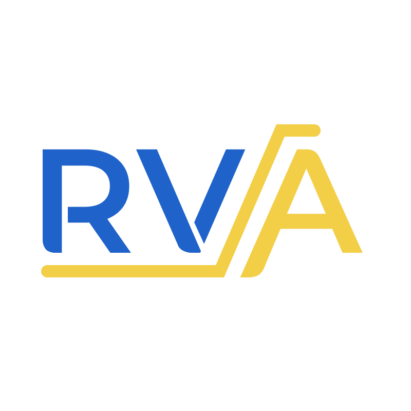

# RISC-V Analyzer



A RISC-V assembly static analyzer for coding convention violations.

RISC-V Analyzer (RVA) is a static analyzer for RISC-V assembly code written in 
Rust. It is designed to detect coding convention violations against RISC-V
register conventions and calling conventions. RVA is built on top of the
[RISC-V Instruction Set Manual](https://riscv.org/specifications/).


RVA is available as a VSCode extension or a command line tool.

## Installation

### VSCode Extension

1. Install [VSCode](https://code.visualstudio.com/).
2. Download the RVA `.vsix` file from the [latest release](github.com/rajanmaghera/riscv-analysis/releases/latest).
3. Navigate to the extensions tab in VSCode.
4. Click the three dots in the top right corner and select "Install from VSIX..."
5. Select the RVA `.vsix` file you downloaded.
6. Reload VSCode.

The RVA extension should now be installed and will be activated when you open
a `.s` file. 

If you cannot see any errors, try opening the command palette `Ctrl/Cmd-Shift-P` 
and running `Developer: Reload Window`.

### CLI

1. Download the RVA binary for your platform from the [latest release](github.com/rajanmaghera/riscv-analysis/releases/latest).
2. Add the RVA binary to your path.
3. Run `rva` from the command line.

## Usage

If you have any issues, please open an issue on the GitHub issues page. Please
include the assembly code that is causing the issue. If you are unable to share
the code, please send an email to rmaghera@ualberta.ca with the code segment. If
you are a student in CMPUT 229, this does not count as a sharing violation.

## About the Analysis

This tool consists of two parts: a RISC-V assembly parser and a set of
checkers. It is all written from scratch in Rust. 

The checkers implement forms of abstract interpretation and data flow analysis. They do 3 main things:

1. determine what registers are live at each instruction, aka. have a value that
   is used later in the program.
2. determine what values are in each register at each instruction.
3. determine what registers are used to pass arguments to functions.

This information coupled with the control flow graph of the program is used to
detect violations of the RISC-V register conventions and calling conventions.

A common example of a violation is using a callee saved register without saving
it first. This is a violation because the callee saved registers are not
guaranteed to have the same value after a function call. For example, the
following code is incorrect.

```asm
addi t1, zero, 40
jal ra, foo
addi t2, t1, 1
```

In this case, `t1` is a callee saved register. The value of `t1` is not
guaranteed to be the same after the function call. This violation is detected
by RVA.
